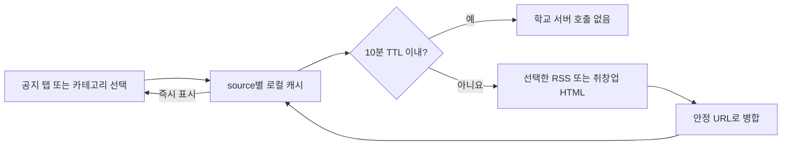

# 아키텍처

이 문서는 LinKU가 런타임에서 어떻게 구성되는지, 그리고 어느 위치를 어떻게
수정해야 안전한지 설명합니다.

## 시스템 개요

LinKU는 Vite, React, TypeScript, Tailwind CSS로 만든 Manifest V3 Chrome
Extension입니다. 확장 프로그램은 세 개의 런타임 영역을 가집니다.

- `index.html`에서 렌더링되는 Popup UI.
- `src/background/index.ts`에서 빌드되는 Background service worker.
- `src/content/everytime-timetable.ts`에서 빌드되어 에브리타임 시간표
  페이지에서만 실행되는 content script.

대부분의 user interaction은 popup 내부에서 일어납니다. content script는
로그인된 에브리타임 탭에서 시간표 XML API를 호출하고, API를 사용할 수 없을 때만
렌더링된 시간표 DOM을 구조화해 읽습니다. 브라우저가 요청에 기존 로그인 쿠키를
자동으로 포함하지만 LinKU는 password, cookie, session token을 직접 읽거나
저장하지 않습니다.

## Backend 의존성

LinKU는 frontend-only extension이 아닙니다. auth, template sync, posted
template, icons, alerts 같은 backend 연동 기능은 `VITE_API_BASE_URL`이
올바르게 설정되어야 동작합니다.

로컬 개발 환경에서 `VITE_API_BASE_URL`이 없거나 placeholder 값으로 남아
있다면, 다음 기능은 정상적으로 동작하지 않을 수 있습니다.

- Google OAuth login
- template sync와 posted-template API
- icons API
- alerts subscription API
- `src/apis/` 아래 LinKU backend를 호출하는 기타 기능

## 빌드 모델

`vite.config.ts`는 extension mode에서 multi-entry build를 설정합니다.

- `index.html`은 popup entry가 됩니다.
- `src/background/index.ts`는 `background/index.js`가 됩니다.
- `src/content/everytime-timetable.ts`는
  `content/everytime-timetable.js`가 됩니다.

`gh-pages` mode에서는 build output이 `gh-pages/`로 바뀌고, static hosting을
위해 banner asset이 복사됩니다. extension build의 output directory는
`dist/`입니다.

중요한 script:

```bash
pnpm run dev
pnpm run build:local
pnpm run build
pnpm run watch:local
pnpm run build:gh-pages
```

`pnpm run build`는 build 전에 manifest patch version을 증가시킵니다. local
validation에서 version bump를 원하지 않는다면 `pnpm run build:local`을
사용하세요.

## 런타임 진입점

Popup UI 흐름:

```text
index.html
  -> src/main.tsx
  -> src/routes.tsx
  -> src/App.tsx
  -> route pages and layouts
```

Background worker 흐름:

```text
public/manifest.json
  -> background.service_worker: background/index.js
  -> src/background/index.ts
  -> src/background/handlers/oauth.ts
  -> src/background/handlers/timetable.ts
```

Everytime import 흐름:

```text
public/manifest.json
  -> content_scripts.matches: https://everytime.kr/timetable*
  -> src/content/everytime-timetable.ts
  -> Everytime semester/table XML API (rendered DOM fallback)
  -> chrome.runtime message
  -> src/background/handlers/timetable.ts
  -> chrome.storage.local structured timetable collection
```

popup은 React Router의 hash routing을 사용합니다. Chrome extension popup
page는 일반적인 server-backed web route처럼 동작하지 않기 때문에 hash routing을
사용합니다.

## 라우트

route는 `src/routes.tsx`에 정의되어 있습니다.

- `/`: `MainLayout` 안의 main popup page.
- `/editor`: 새 template editor.
- `/editor/:templateId`: 기존 template editor.
- `/templates`: owned/local template list.
- `/gallery`: public posted-template gallery.
- `*`: not found page.

`src/App.tsx`는 root error boundary, global providers, page-view analytics,
toast rendering을 제공합니다.

## 소스 구조

```text
src/
  apis/          LinKU backend API wrapper
  apis/external/ 학교 또는 외부 서비스 integration
  assets/        local image와 SVG asset
  background/    Manifest V3 service worker code
  components/    feature component와 UI primitive
  content/       제한된 외부 페이지 content script
  constants/     정적 app data
  contexts/      React Context 상태 container
  hooks/         reusable React hook
  layouts/       route layout wrapper
  pages/         route 단위 screen
  types/         공유 TypeScript contract
  utils/         storage, auth, analytics, template, Chrome helper
```

## 주요 기능 영역

기본 popup 기능:

- Link groups: `src/components/Tabs/LinkGroup.tsx`
- Banners: `src/components/Tabs/ImageCarousel.tsx`
- Todo list: `src/components/Tabs/TodoList/`
- Alerts: `src/components/Tabs/Alerts/`
- Timetable: `src/components/Tabs/TimeTable/`
- Labs: `src/components/Labs/`

Template system 구성:

- Editor page: `src/pages/EditorPage.tsx`
- Template list: `src/pages/TemplateListPage.tsx`
- Public gallery: `src/pages/GalleryPage.tsx`
- Editor state: `src/contexts/EditorContext.tsx`
- Editor UI: `src/components/Editor/`
- Local template persistence: `src/utils/templateStorage.ts`
- Template helper: `src/utils/template.ts`

Auth 및 account 관련 UI:

- OAuth popup/background bridge: `src/utils/oauth.ts`
- Background OAuth handler: `src/background/handlers/oauth.ts`
- Background timetable handler: `src/background/handlers/timetable.ts`
- API auth interceptor: `src/apis/client.ts`
- Email verification dialog: `src/components/EmailVerificationDialog.tsx`
- Settings dialog: `src/components/SettingsDialog.tsx`

## Popup과 Background 통신

popup은 `chrome.runtime.sendMessage`를 사용해 background service worker와
통신합니다.

message type과 guard는 `src/background/types.ts`에 있습니다.

background worker가 처리하는 일:

- Google login request.
- Silent reauth request.
- User-triggered Everytime timetable import request.
- Extension install/update event.
- Badge count initialization.
- `chrome.storage.local` 변경에 따른 badge count update.

OAuth는 background worker에 있습니다. `chrome.identity.launchWebAuthFlow`는
일반 browser page flow가 아니라 extension API로 다뤄야 하기 때문입니다.

## Backend API 흐름

중앙 HTTP client는 `src/apis/client.ts`입니다.

주요 책임:

- `VITE_API_BASE_URL`에서 backend URL을 구성합니다.
- `chrome.storage.local`의 bearer token을 request에 붙입니다.
- backend response envelope을 parsing합니다.
- token-expired backend code `5004`를 감지합니다.
- background worker에 silent reauth를 요청합니다.
- silent reauth 성공 후 original request를 한 번 retry합니다.
- hard auth failure에서 `auth:unauthorized`를 dispatch합니다.

feature-specific API module은 fetch behavior를 중복 구현하지 말고 이 client를
사용해야 합니다.

## Storage 모델

현재 storage는 세 browser storage system으로 나뉘어 있습니다.

- `chrome.storage.local`: auth token, user profile state, settings, custom
  todo, library token, badge count, timetable metadata.
- `localStorage`: `src/utils/templateStorage.ts`를 통한 template draft와 local
  template persistence.
- IndexedDB: 사용자가 직접 업로드한 PNG, JPG/JPEG, WebP, GIF, AVIF timetable
  이미지 blob만 저장합니다. 이미지와 metadata index를 분리해 향후 backend
  sync를 붙일 수 있도록 metadata에 schema version과 sync status를 둡니다.
- `chrome.storage.local`: 에브리타임 원본 snapshot은 `timetableAssetIndex`의
  schema v3 asset에, 사용자 수정은 별도 `timetableEverytimeOverrides`의 schema
  v1 index에 저장합니다. 조회할 때만 `src/utils/everytimeTimetable.ts`가 두 층을
  병합합니다. 동기화는 snapshot만 갱신하므로 사용자 수정 저장소를 덮지 않습니다.
  원본 HTML, password, cookie, session token은 저장하지 않습니다.

이 분리는 과거 설계의 결과입니다. template local persistence flow를 직접
수정하는 경우가 아니라면, 새 extension-wide state는 `chrome.storage.local`을
우선 사용하세요.

stored data shape를 바꿀 때는 기존 user의 migration behavior를 고려해야
합니다. LinKU는 실제 user에게 배포되는 extension이므로 가능한 한 backward
compatible해야 합니다. 시간표 asset schema v2는 처음 읽을 때 v3 snapshot
구조로 자동 변환합니다.

## 인증

Google OAuth flow는 backend-mediated flow입니다.

1. popup이 background worker에 login 시작을 요청합니다.
2. background worker가 extension redirect URI를 계산합니다.
3. background worker가 `chrome.identity.launchWebAuthFlow`로 backend Google
   OAuth URL을 엽니다.
4. backend가 auth code를 포함해 redirect합니다.
5. background worker가 backend를 통해 code를 token으로 교환합니다.
6. token은 `chrome.storage.local`에 저장됩니다.
7. popup/API state가 auth success 또는 failure에 반응합니다.

auth code, access token, refresh token, full token response를 로그로 남기지
마세요.

## 외부 연동

`src/apis/external/`에는 이 repository가 소유하지 않는 integration이 있습니다.
예시는 eCampus, library, banners, RSS, HTML parsing입니다.

이 module들은 external service의 response shape 또는 DOM structure가 바뀌면
깨질 수 있습니다. 이 영역의 변경은 PR에 manual verification notes를 포함해야
합니다.

### 공지 캐시와 동기화

공개 공지는 backend가 아니라 건국대학교의 카테고리별 RSS 5개와 취창업 HTML
목록 1개에서 가져옵니다. `src/apis/public-alert-cache.ts`는 이 여섯 source를
`chrome.storage.local`의 `publicAlertCacheV1:<source>` 키에 각각 저장합니다.



- 전체 화면은 만료된 source만 갱신하고, 카테고리 화면은 선택한 source만
  갱신합니다.
- 첫 동기화는 최신 한 페이지만 저장합니다. 이후 동기화는 직전 첫 페이지의
  끝부분을 기준점으로 삼아, 기준점을 다시 만날 때까지 다음 페이지를 읽습니다.
- 여러 페이지를 읽은 경우 첫 페이지를 다시 확인합니다. 읽는 도중 목록이
  바뀌었다면 한 번 다시 시작하며, 완전한 경계를 확인하지 못한 결과는 저장하지
  않습니다.
- 동일 공지는 정규화된 URL로 병합하고, 실패한 source는 기존 캐시와 기준점을
  유지해 다음 화면 진입에서 다시 시도합니다.
- `chrome.storage.local` 용량을 잠식하지 않도록 source별 최신 500개까지만
  보존합니다.
- popup이 닫힌 동안 실행되는 background alarm은 없습니다. 캐시가 만료된 뒤
  사용자가 공지 화면을 열거나 카테고리를 바꿀 때만 network sync가 일어납니다.

학교 접근은 `fetchPublicAlertPage` 한 함수에 모여 있어 중앙 수집기가 생기면 이
경계만 교체할 수 있습니다. 단, frontend-only 구조에서는 학교가
게시물을 source에서 제거하거나 local storage가 삭제된 기간까지 절대적인 무누락을
보장할 수 없으며, 현재 공개된 목록 안에서 확인 가능한 동기화 경계만 보존합니다.

### Everytime 시간표

사용자가 popup에서 가져오기를 누르면 background worker는 이미 열린
`https://everytime.kr/timetable*` 탭을 우선 사용합니다. 탭이 없으면 비활성
임시 탭을 열고, 로그인이 필요한 경우에만 해당 탭을 활성화합니다. 로그인 후에는
content script가 `#semesters`에서 학기 목록을 읽고, 현재 학사 시기를 기준으로
에브리타임의 학기별 XML API를 동시 네 개까지 요청합니다. API를 사용할 수 없을
때만 비활성 탭에서 해당 학기를 실제 렌더링한 뒤 DOM을 읽습니다. 1학기(1~6월)에는 해당 연도의
1학기를, 여름방학(7~8월)과 2학기(9~12월)에는 해당 연도의 2학기를 첫 항목으로
잡습니다. 첫 네 학기가 모두 비어 있으면 그보다 이전 네 학기를 이어서 요청하며,
수업이 하나라도 발견되거나 에타의 학기 목록 끝에 도달하면 멈춥니다. XML 응답에서는
학기 시작·종료일과 지원 상태, 시간표 ID·이름·공개/대표 여부·생성/수정일,
과목 ID·내부 ID·교수·학점·폐강 여부·시간 원문, 각 수업의 요일·시작/종료값·강의실을
구조화해 `chrome.storage.local`에 저장합니다. 시간이 없는 과목도 `courses`에
남겨 정보가 유실되지 않도록 합니다. DOM fallback은
`#container.timetable table.tablebody div.cols > div.subject`에서 화면에 존재하는
필드만 읽습니다. popup의 `이전 4학기 추가`
메뉴는 그보다 앞선 네 개 학기를 같은 과정으로 추가합니다.

시간표 갱신은 popup에서 사용자가 `동기화`를 누른 경우에만 실행됩니다. 새 학기는
기존 collection에 추가하고, 같은 에브리타임 학기는 최신 snapshot으로 갱신하되
다른 학기와 직접 업로드한 이미지는 삭제하지 않습니다. 이미 사용자가 보고 있던
시간표가 있으면 active 선택도 바꾸지 않습니다. 사용자 수정은 course/subject
override와 숨김·사용자 추가 항목으로 별도 저장되며, 화면에서는 최신 snapshot에
이를 병합합니다. 시간표 자체를 삭제할 때만 해당 override도 함께 삭제합니다.
시간표 화면은 기본 월~금 열을 popup 전체 폭으로 표시하고, 실제 토요일·일요일
수업이 있을 때만 해당 요일 열을 추가합니다. 짧은 시간표도 남은 세로 영역을
채우며, 긴 시간표는 내부 세로 스크롤로 확인합니다.
LinKU는 에브리타임 password, cookie, session token을 읽거나 저장하지 않습니다.

## UI 시스템

UI는 다음을 사용합니다.

- Styling에는 Tailwind CSS를 사용합니다.
- `src/components/ui/` 아래에는 shadcn-style Radix wrapper가 있습니다.
- Icon에는 `lucide-react`를 사용합니다.
- Toast notification에는 `sonner`를 사용합니다.
- Editor drag behavior에는 `@dnd-kit/*`를 사용합니다.
- Carousel behavior에는 `embla-carousel`을 사용합니다.

새 component library를 도입하기보다 existing UI primitive와 local pattern을
우선 사용하세요.

## CI와 배포

GitHub Actions workflow는 `.github/workflows/`에 있습니다.

- `pr-build-check.yml`: PR에서 local production-like build check를 실행합니다.
- `upload-chrome-extension-draft.yml`: main에서 Chrome Web Store draft를
  upload합니다.
- `create-release.yml`: GitHub Release를 만들고 built zip을 첨부합니다.
- `deploy-gh-pages.yml`: static assets/pages를 `gh-pages`에 deploy합니다.

main branch는 release-sensitive합니다. versioning과 deployment behavior는
의도적으로 변경하고 PR에 문서화해야 합니다.

## 알려진 기술 부채

- lint는 설정되어 있지만 현재 PR CI에서 강제하지 않습니다.
- test framework 또는 automated browser extension test suite가 없습니다.
- `README.md`는 product-focused 문서이며, 깊은 협업 문서는 `docs/` 아래에
  있습니다.
- 일부 production code에 diagnostic logging이 남아 있습니다.
- `public/manifest.json`에는 broad host permissions가 포함되어 있습니다.
- template persistence는 `localStorage`를 사용하고, 다른 extension state는
  `chrome.storage.local`을 사용합니다.

이 항목들은 별도 cleanup PR로 다루기 좋습니다. unrelated feature work에 섞지
마세요.
