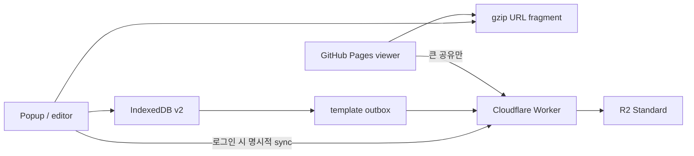

# Cloudflare 계정 동기화 운영

LinKU의 편집과 로컬 저장은 Cloudflare 없이 동작합니다. 이 계층은 Google 계정으로
로그인한 사용자가 템플릿을 여러 Chrome 기기에서 동기화하고, URL fragment에 담기지
않는 큰 템플릿을 제한된 기간 공유할 때만 사용합니다.

## 제품 경계

| 기능 | 실행/저장 위치 | Worker 장애 시 |
| --- | --- | --- |
| 템플릿 편집·검증·압축 | extension | 정상 |
| 개인 템플릿·draft·아이콘 | IndexedDB | 정상 |
| 작은 공유 | GitHub Pages URL fragment | 정상 |
| Google OAuth code 교환 | Worker | 새 로그인 불가 |
| 계정 세션 | R2 private object | 기존 로컬 기능 정상 |
| 템플릿 동기화 | IndexedDB outbox → Worker → R2 | outbox에 보존 |
| 큰 공유 | Worker → R2 public object | `.linku.json` 파일로 대체 |

D1, KV, Durable Objects, Queue, 상시 실행 서버는 사용하지 않습니다. 게시·검색·좋아요와
같은 커뮤니티 기능은 다중 사용자 index와 moderation 정책이 필요하므로 이 PR의
cloud share와 같은 기능으로 취급하지 않습니다.

## 데이터 흐름



- 저장은 IndexedDB transaction이 먼저 완료합니다. 원격 실패가 로컬 저장을
  rollback하지 않습니다.
- 템플릿마다 UUID와 R2 ETag를 사용합니다. 새 object는 `If-None-Match: *`, 기존
  object는 `If-Match`로 저장합니다.
- 충돌하면 로컬 변경을 새 UUID의 `(충돌 복사본)`으로 남기고 원격본을 원래 위치에
  반영합니다.
- 삭제 중 원격 변경이 확인되면 최신 원격본을 `(삭제 충돌 복사본)`으로 먼저 남긴
  뒤 삭제를 재시도합니다.
- 삭제는 30일 tombstone으로 전달합니다. 30일 넘게 offline인 기기의 복구 정책은
  event log가 필요한 단계에서 다시 설계합니다.
- outbox는 항목별로 실패 횟수와 오류를 기록합니다. 한 항목 실패가 다음 항목의
  동기화를 막지 않습니다.
- 서로 다른 Google 계정의 원격 metadata는 섞지 않습니다. 같은 Chrome profile에서
  계정을 바꾸려면 기존 계정 데이터 삭제를 명시적으로 거쳐야 합니다.

## 인증

Google OAuth의 `openid email profile`만 요청합니다. Worker는 Google JWKS로 ID token
서명과 issuer, audience, expiry, nonce, `email_verified`를 검증합니다. Google
이메일 도메인은 제한하지 않으며 KU 이메일 인증 단계는 없습니다.

Google `sub` 원문은 저장하지 않습니다. issuer와 함께 SHA-256한 opaque account ID만
R2 key에 사용합니다. 자체 JWT 대신 256-bit 임의 access/refresh token을 발급하고,
R2 session object에는 token secret의 SHA-256 hash만 저장합니다.

- access token: 15분, `chrome.storage.session`
- refresh token: 30일, extension context로 제한한 `chrome.storage.local`
- 동시 device session: 계정당 최대 5개
- refresh 시 access/refresh token 모두 회전
- logout/계정 삭제: R2 session object 제거로 즉시 무효화

필요한 Worker secret은 다음 두 개뿐입니다.

```text
GOOGLE_CLIENT_ID
GOOGLE_CLIENT_SECRET
```

확장 프로그램의 계정 API 주소는 `https://linku.turtlehwan.dev/api`로 고정해 기존
백엔드용 `VITE_API_BASE_URL`과 분리합니다. 따라서 계정 동기화를 위해 추가하는
프론트엔드 환경 변수는 없습니다.

Google OAuth client에는 LinKU 전용 Web application 자격 증명을 만들고 다음 redirect
URI를 정확히 등록합니다.

```text
https://linku.turtlehwan.dev/api/auth/google/callback
```

## R2 구조와 제한

```text
auth/oauth-states/{sha256(state)}.json
auth/exchanges/{sha256(code)}.json
auth/sessions/{account-id}/{device-id}.json
private/{account-id}/templates/{template-uuid}.json
private/{account-id}/share-index/{share-id}.json
public/shares/{share-id}.json
```

application quota는 계정당 템플릿 50개, session 5개, 활성 cloud share 20개입니다.
payload는 256KB 이하이고 cloud share는 30일 후 만료됩니다. R2 lifecycle rule도
다음 prefix에 설정해 요청이 없어도 임시 object가 정리되게 합니다.

- `auth/oauth-states/`: 1일
- `auth/exchanges/`: 1일
- `public/shares/`: 31일

## 최초 설정

R2 Standard subscription을 활성화한 뒤 bucket을 만듭니다. R2는 무료 사용량이
포함된 usage-based subscription이므로, “무료 한도 안에서 운영”은 가능하지만 코드가
초과 과금을 원천 차단해 주지는 않습니다.

```bash
pnpm exec wrangler r2 bucket create linku-data
pnpm exec wrangler r2 bucket create linku-data-preview
pnpm exec wrangler secret put GOOGLE_CLIENT_ID
pnpm exec wrangler secret put GOOGLE_CLIENT_SECRET
```

로컬 Worker 검증에서는 커밋하지 않는 `.dev.vars`를 사용합니다.

```bash
cp .dev.vars.example .dev.vars
pnpm exec wrangler dev
```

`wrangler.jsonc`의 custom domain을 사용하려면 `turtlehwan.dev` zone이 같은 Cloudflare
account에 있어야 합니다. CI 배포에는 repository secret으로 다음 두 값을 둡니다.

- `CLOUDFLARE_API_TOKEN`: Worker 배포와 R2 binding에 필요한 최소 권한
- `CLOUDFLARE_ACCOUNT_ID`: 대상 account ID

## 무료 한도와 운영 경보

2026-08-12 기준 공식 한도는 Workers Free 100,000 requests/day, 10ms CPU/request이며,
R2 Standard 무료 구간은 10GB-month, Class A 1M/month, Class B 10M/month입니다.
현재 Worker dry-run bundle은 gzip 약 9KB이고 CPU 제한을 10ms로 고정했습니다.

Cloudflare Rate Limiting binding은 인증, 공개 공유, 계정 요청을 나눠 적용하지만
location-local이며 정확한 과금 차단 장치가 아닙니다. Cloudflare Billing budget
alert를 낮게 설정하고 Workers/R2 사용량을 확인해야 합니다.

- [Workers limits](https://developers.cloudflare.com/workers/platform/limits/)
- [R2 pricing](https://developers.cloudflare.com/r2/pricing/)
- [R2 get started](https://developers.cloudflare.com/r2/get-started/)
- [R2 conditional operations](https://developers.cloudflare.com/r2/api/workers/workers-api-reference/)

## 검증과 배포

```bash
pnpm run test:worker
pnpm run build:local
pnpm run build:gh-pages
pnpm run build:worker
pnpm run lint
```

`build:worker`는 `wrangler deploy --dry-run`이라 외부 상태를 바꾸지 않습니다. 실제
배포는 `Deploy Cloudflare Worker` workflow를 수동 실행합니다. 배포 후에는 health,
Google 계정 선택, 두 Chrome profile 간 템플릿 왕복, offline 편집 재시도, 충돌
복사본, cloud share 만료, 계정 데이터 삭제를 실제 extension runtime에서 확인합니다.
